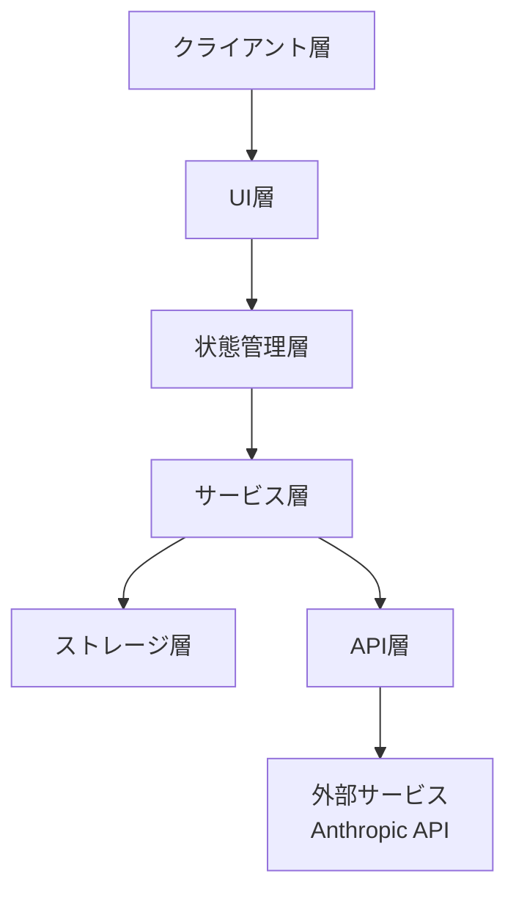
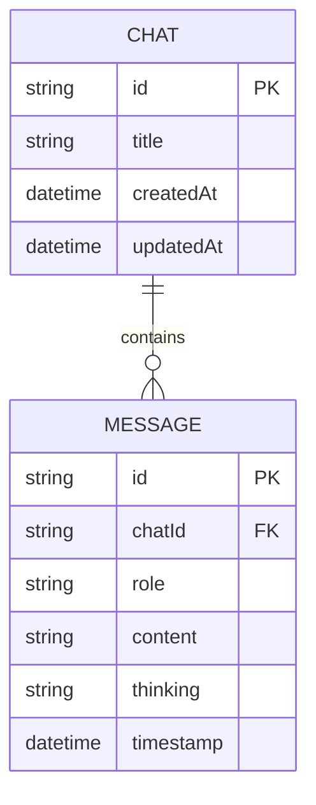
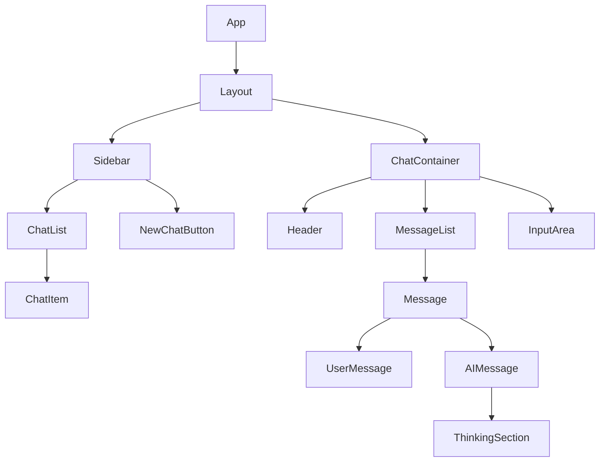

# System Patterns: Sonnet Thinking

## システムアーキテクチャ

### クライアント層
- Next.js 15.1.7をフレームワークとして使用
- React 19.0.0をUIライブラリとして使用
- TypeScriptで型安全性を確保

### UI層
- Tailwind CSSを使用したコンポーネント設計
- レスポンシブデザインの実装
- アクセシビリティに配慮したUI

### 状態管理層
- React Hooksを使用した状態管理
- コンテキストAPIを使用したグローバル状態の管理
- 必要に応じてReact Query等の導入を検討

### サービス層
- チャット管理サービス
- メッセージ管理サービス
- Anthropic API連携サービス

### ストレージ層
- IndexedDBを使用したローカルデータの永続化
- idbライブラリを使用したIndexedDBの操作

### API層
- @anthropic-ai/sdkを使用したAnthropic APIとの連携
- 非ストリーミングモードでのAPI呼び出し
- エラーハンドリングとリトライロジック

## データモデル

### チャットモデル
- `id`: チャットの一意識別子
- `title`: チャットのタイトル
- `createdAt`: チャット作成日時
- `updatedAt`: チャット更新日時

### メッセージモデル
- `id`: メッセージの一意識別子
- `chatId`: 所属するチャットのID（外部キー）
- `role`: メッセージの役割（"user" または "assistant"）
- `content`: メッセージの内容
- `thinking`: AIの思考プロセス（assistantメッセージの場合のみ）
- `timestamp`: メッセージのタイムスタンプ

## コンポーネント構造

## 主要なデザインパターン

### コンテナ/プレゼンテーションパターン
- コンテナコンポーネント: ロジックと状態を管理
- プレゼンテーションコンポーネント: UIのみを担当

### カスタムフック
- `useChat`: チャット関連の状態と操作を提供
- `useMessages`: メッセージ関連の状態と操作を提供
- `useIndexedDB`: IndexedDBとの操作を抽象化

### サービスレイヤー
- `chatService`: チャット関連のビジネスロジック
- `messageService`: メッセージ関連のビジネスロジック
- `anthropicService`: Anthropic API連携ロジック

## エラーハンドリング戦略
- グローバルエラーバウンダリの実装
- APIエラーの適切な処理と表示
- オフライン状態の検出と対応

## パフォーマンス最適化
- コンポーネントのメモ化
- 仮想スクロールの実装（メッセージリストが長くなる場合）
- 画像やアセットの最適化

## セキュリティ考慮事項
- APIキーの安全な管理
- ユーザーデータの適切な保護
- 入力のサニタイズ
